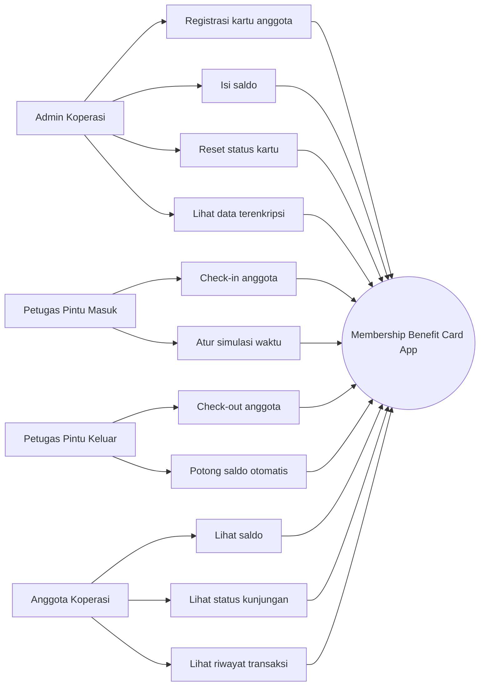
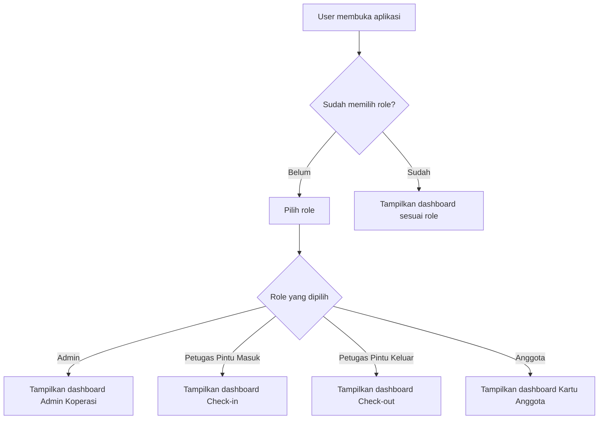
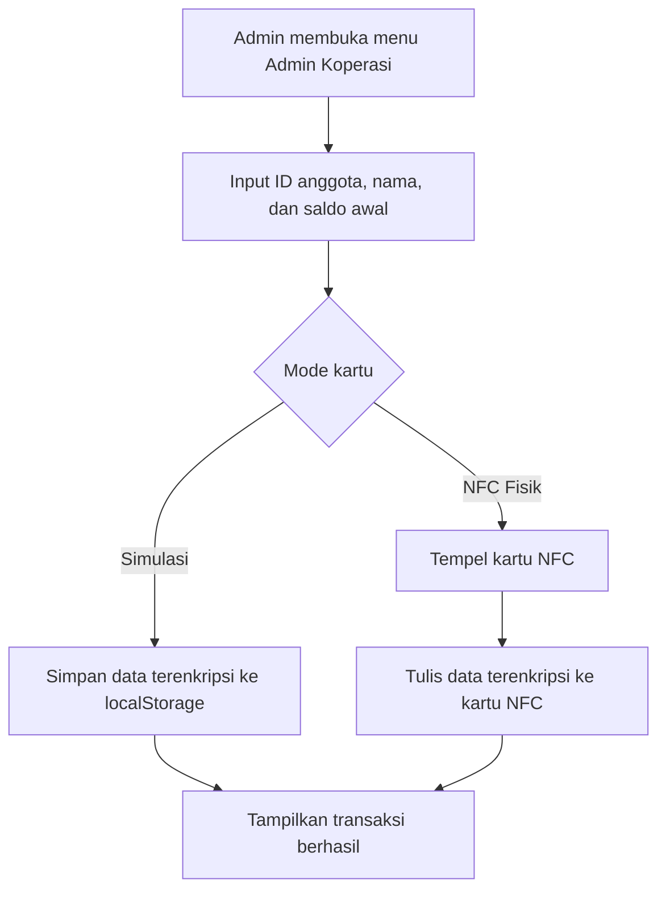
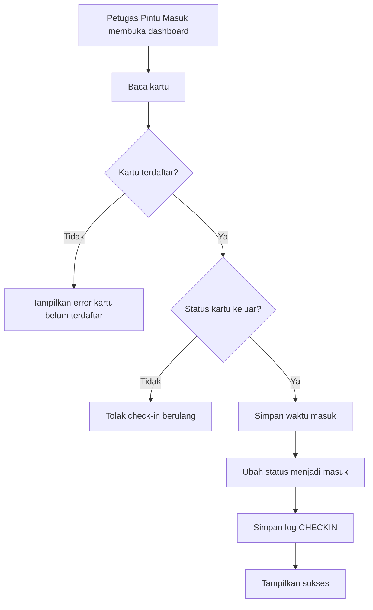
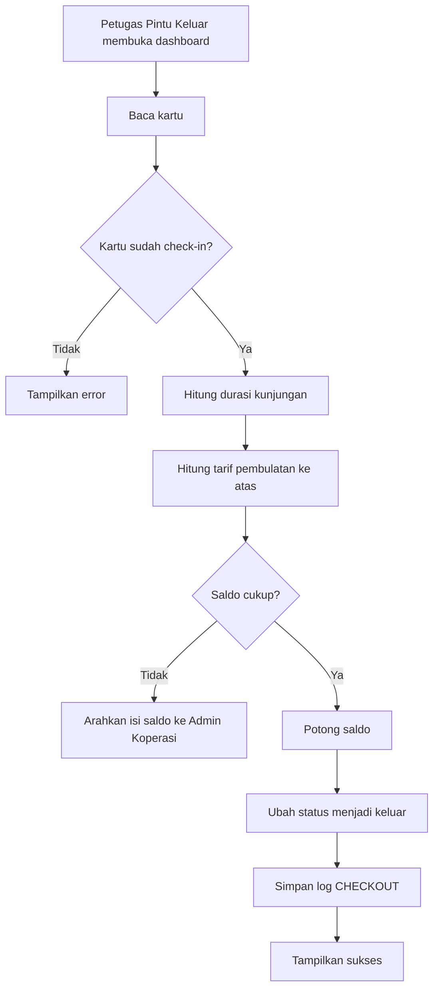
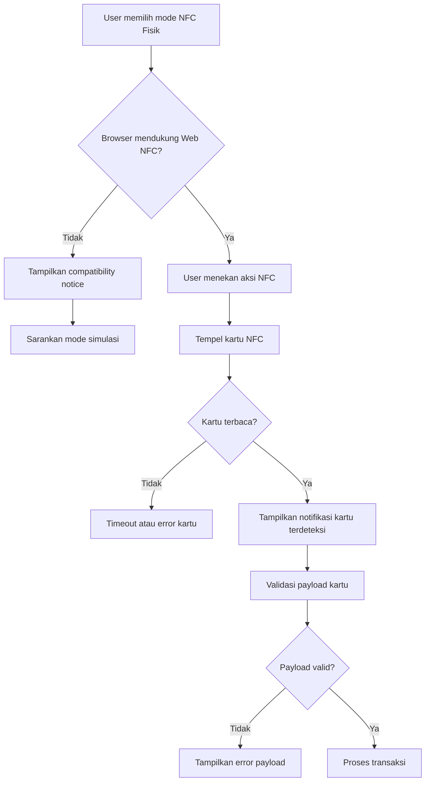
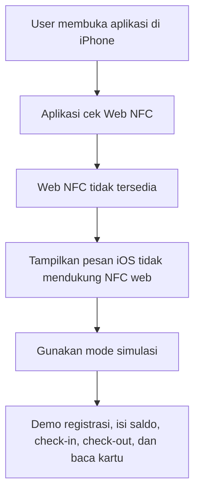
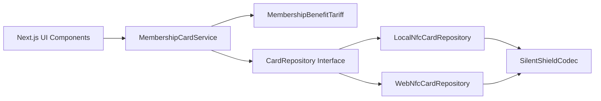

# Dokumentasi Membership Benefit Card (MBC)

Dokumen ini merangkum fitur aplikasi **Membership Benefit Card (MBC)** yang sudah dikembangkan, alur penggunaan, role pengguna, batasan teknis, diagram use case, flow aplikasi, dan catatan demo agar mudah dibaca dan dipresentasikan.

## Judul Fitur

**Multilingual Offline NFC Membership App with iOS Simulation Fallback**

## Ringkasan

Membership Benefit Card (MBC) adalah aplikasi operasional koperasi berbasis kartu anggota. Aplikasi mendukung registrasi kartu, isi saldo, check-in, check-out, pemotongan saldo, baca kartu anggota, mode simulasi lokal, NFC fisik di Android Chrome, bilingual ID/EN, dan fallback simulasi untuk iOS.

| Mode | Fungsi | Target Perangkat |
|---|---|---|
| Simulasi Lokal | Menyimpan data kartu di browser untuk demo dan pengujian | Semua browser, termasuk iPhone/iOS |
| NFC Fisik | Membaca/menulis data terenkripsi ke kartu NFC NDEF | Google Chrome Android dengan Web NFC |

## Role Pengguna

| Role | Nama UI | Hak Akses |
|---|---|---|
| Admin Koperasi | Admin Koperasi | Registrasi kartu, isi saldo, reset status kartu, melihat data terenkripsi |
| Petugas Gate | Petugas Pintu Masuk | Check-in anggota |
| Petugas Terminal | Petugas Pintu Keluar | Check-out anggota dan potong saldo |
| Anggota Koperasi | Kartu Anggota | Melihat isi kartu pribadi secara read-only |

## Fitur yang Sudah Dikembangkan

### Role-Based Access

- User memilih role saat login.
- Setiap role hanya melihat fitur sesuai PRD.
- Admin hanya melihat fitur registrasi, isi saldo, reset status, dan data terenkripsi.
- Petugas Pintu Masuk hanya melihat fitur check-in.
- Petugas Pintu Keluar hanya melihat fitur check-out dan pemotongan saldo.
- Anggota hanya melihat informasi kartu secara read-only.

### Registrasi Kartu

- Admin dapat mengisi ID anggota, nama, dan saldo awal.
- Data kartu disimpan dalam format terenkripsi.
- Pada mode simulasi, data disimpan di browser.
- Pada mode NFC fisik, data ditulis ke tag NFC NDEF.

### Isi Saldo

- Admin dapat mengisi saldo secara manual.
- Tersedia shortcut nominal cepat.
- Validasi nominal harus lebih dari 0.
- Transaksi isi saldo masuk ke log kartu.

### Check-In

- Petugas Pintu Masuk dapat melakukan check-in.
- Kartu harus sudah terdaftar.
- Status kartu harus keluar sebelum check-in.
- Check-in berulang akan ditolak.
- Tersedia mode simulasi waktu untuk menguji tarif check-out.

### Check-Out dan Pemotongan Saldo

- Petugas Pintu Keluar dapat melakukan check-out.
- Status kartu harus masuk sebelum check-out.
- Tarif dihitung otomatis.
- Saldo dipotong sesuai durasi kunjungan.
- Jika saldo tidak cukup, user mendapat pesan untuk isi saldo melalui Admin Koperasi.

### Tarif Benefit Anggota

| Kondisi | Hasil |
|---|---|
| Tarif dasar | Rp2.000 per jam |
| Pembulatan | Dibulatkan ke atas |
| 0ms | 1 jam |
| 59 menit | 1 jam |
| 60 menit | 1 jam |
| 61 menit | 2 jam |

### Log Transaksi

- Kartu menyimpan maksimal 5 transaksi terakhir.
- Log terbaru berada di atas.
- Jika lebih dari 5 transaksi, log lama dibuang.
- Jenis log meliputi REGISTER, TOPUP, CHECKIN, CHECKOUT, dan RESET.

### Enkripsi Data Kartu

- Data sensitif tidak disimpan dalam plaintext.
- Payload menggunakan AES encryption dan checksum.
- Data yang dilindungi meliputi ID anggota, nama, saldo, status kunjungan, dan riwayat transaksi.

### NFC Fisik

- Aplikasi menggunakan Web NFC API melalui `NDEFReader`.
- Saat kartu berhasil terbaca, user mendapat notifikasi.
- Jika serial kartu tersedia, serial ditampilkan di feedback.
- Operasi update NFC dilakukan dalam dua tahap: baca kartu dan siapkan perubahan, lalu tulis perubahan ke kartu yang sama.

### iOS Simulation Fallback

- iPhone/iOS belum mendukung Web NFC untuk aplikasi web/PWA.
- Aplikasi menampilkan pesan kompatibilitas yang jelas.
- User iPhone tetap bisa mencoba semua flow dengan mode simulasi lokal.
- Mode simulasi menjadi fallback resmi untuk demo menggunakan iPhone.

### Multi-Language UI

- Aplikasi mendukung Bahasa Indonesia dan English US.
- Tombol kanan atas digunakan sebagai language switcher.
- Preferensi bahasa tersimpan di localStorage.
- Indikator bendera berubah mengikuti bahasa aktif:
  - ID: bendera Indonesia
  - EN: bendera UK/Union Jack

### PWA dan Offline Shell

- Aplikasi memiliki manifest PWA.
- Aplikasi memiliki service worker untuk cache dasar.
- Offline cache bersifat tambahan.
- Flow transaksi tetap dirancang berjalan secara lokal.

## Use Case Diagram



## Flow Aplikasi

### Flow Login Role



### Flow Registrasi Kartu



### Flow Check-In



### Flow Check-Out



### Flow NFC Fisik



### Flow iOS Fallback



## Arsitektur Singkat



## Prinsip SOLID

| Prinsip | Implementasi |
|---|---|
| Single Responsibility | Service menangani aturan transaksi, repository menangani penyimpanan, codec menangani enkripsi |
| Open/Closed | Repository dapat diganti antara local simulation dan Web NFC tanpa mengubah service |
| Liskov Substitution | LocalNfcCardRepository dan WebNfcCardRepository memakai kontrak CardRepository yang sama |
| Interface Segregation | Kontrak domain dipisah melalui CardRepository, CardCodec, TariffPolicy, dan Clock |
| Dependency Inversion | MembershipCardService bergantung pada interface, bukan implementasi langsung |

## Gap yang Sudah Ditutup

| Gap Awal | Status Saat Ini |
|---|---|
| Role belum sesuai PRD | Sudah sesuai role dan fitur masing-masing |
| NFC fisik tidak jelas statusnya | Ada status kompatibilitas dan notifikasi deteksi NFC |
| iOS tidak bisa NFC | Ada fallback simulasi dan pesan khusus iOS |
| Switch NFC sulit dipakai di mobile | Diganti segmented control Simulasi/NFC Fisik |
| Hydration error di mobile | Sudah distabilkan |
| Bahasa UI campur teknis | Copywriting dibuat lebih mudah dipahami |
| Belum ada bilingual | Ada ID/EN switcher |
| Belum ada test lengkap | Ada 44 tests untuk domain, NFC, UI, dan role |

## Testing dan Quality

| Test Area | Coverage |
|---|---|
| MembershipCardService | Register, isi saldo, check-in, check-out, invalid state, max log |
| Tariff | 0ms, 59 menit, 60 menit, 61 menit, invalid timestamp |
| Security | AES payload, checksum, tampered payload |
| Repository | localStorage encrypted payload dan clear card |
| Web NFC | unsupported browser, timeout, kartu kosong, payload rusak, detected callback |
| Role UI | Setiap role hanya melihat fitur sesuai PRD |
| UI Components | Button, Card, Input, Label, Textarea, Alert, Badge, Table, Tabs, Switch, Tooltip |
| Language | Tombol kanan atas mengubah UI ke English US |

Status terakhir:

```text
13 test files passed
44 tests passed
lint passed
production build passed
```

## Cara Demo

### Demo di iPhone/iOS

1. Buka aplikasi dari link HTTPS.
2. Login sebagai Admin Koperasi.
3. Gunakan mode Simulasi.
4. Daftarkan kartu simulasi.
5. Isi saldo.
6. Logout dan masuk sebagai Petugas Pintu Masuk.
7. Lakukan check-in.
8. Logout dan masuk sebagai Petugas Pintu Keluar.
9. Lakukan check-out dan potong saldo.
10. Logout dan masuk sebagai Anggota Koperasi.
11. Baca kartu simulasi dan lihat saldo/log transaksi.

### Demo NFC Fisik di Android

1. Gunakan Google Chrome Android.
2. Pastikan NFC HP aktif.
3. Buka aplikasi dari link HTTPS.
4. Pilih mode NFC Fisik.
5. Gunakan kartu/tag NFC NDEF writable.
6. Jalankan alur registrasi, check-in, check-out, dan baca kartu.

## Catatan Batasan

- Web NFC tidak tersedia di iPhone/iOS, termasuk PWA.
- Chrome iOS tetap tidak dapat memakai Web NFC karena mengikuti pembatasan iOS.
- NFC fisik membutuhkan Android Chrome dan kartu/tag NDEF writable.
- Kartu e-money, kartu bank, atau kartu akses terenkripsi belum menjadi target implementasi.
- Mode simulasi adalah fallback resmi untuk demo di iPhone.

## Status Akhir

Aplikasi sudah memenuhi PRD utama dan addendum fitur baru. Seluruh gap utama yang ditemukan selama pengembangan sudah ditangani, dengan satu batasan platform yang tidak dapat dihindari: NFC fisik tidak dapat dijalankan dari browser iOS.
